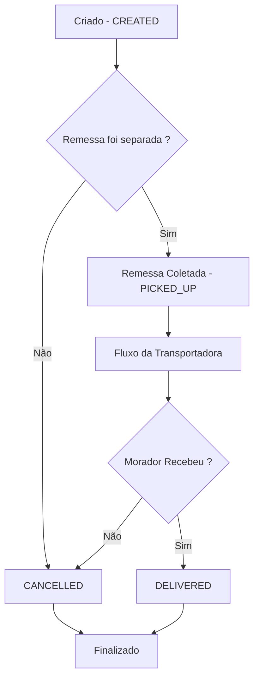

# <center>Delivery Service</center>
<center>Uma aplicação REST para gestão de entregas em logística.</center>

---

## Sobre a Aplicação

A solução, organizada em módulos Maven, utiliza MySQL em produção, H2 e Mockito em testes, migrações com Flyway, monitoramento com Actuator e documentação interativa via OpenAPI/Swagger. A containerização fica a cargo de Docker e Docker Compose, e os logs são gerenciados por SLF4J/Logback.

- Persistência de dados com Spring Data JPA e MySQL
- Versionamento de esquema de banco com Flyway
- Monitoramento e health checks expostos pelo Spring Boot Actuator
- Documentação automática e interativa com Springdoc OpenAPI/Swagger
- Arquitetura multi-módulo Maven (rest-api, business, repository, domain)
- Testes:
   - Repositório: `@DataJpaTest` com H2 em memória
   - Service: Testes unitários com `Mockito`
   - Controller: Requisições e checagens via `MockMvc`
- Containerização com Docker e orquestração via Docker Compose
- Perfis de configuração (`default` , `test`)

---

## Shipment Lifetime



---

## Tech Stack

- Java 21
- Spring Boot 3
- Spring Data JPA
- MySQL 8
- H2 Database (testes de repositório)
- JUnit 5 & Mockito
- Lombok
- Maven
- Flyway
- HikariCP (pool de conexões)
- Spring Boot Actuator
- Springdoc OpenAPI/Swagger
- Docker & Docker Compose
- SLF4J + Logback

---

## Estrutura do Projeto

```
delivery-service
├── pom.xml                    # Parent POM com plugins e dependências comuns
├── docker-compose.yml         # Orquestração: app + MySQL
├── Dockerfile                 # Imagem da aplicação Delivery Service
├── delivery-service-rest-api
│   ├── pom.xml                # Módulo Web (controllers, DTOs, mappers, ExceptionHandler)
│   └── src
├── delivery-service-business
│   ├── pom.xml                # Regras de negócio (controle de entregas)
│   └── src
├── delivery-service-repository
│   ├── pom.xml                # Spring Data JPA (repositories)
│   └── src
├── delivery-service-domain
│   ├── pom.xml                # Entities e Exceptions
│   └── src
└── src
    └── docs
        └── db/migration       # Scripts Flyway
```

---

## Configuração e Execução

### 1. Clonar o repositório

No terminal, execute os seguintes comandos:
```bash
git clone git@github.com:danieldoc/delivery-service.git
```
```bash
cd delivery-service
```

### 2. Execução

- ### 2.1 Utilizando Docker Compose (recomendado)

   ```bash
   docker compose up --build -d
   ```

- ### 2.2 Utilizando estrutura local (Java/Maven/MySQL)

   Certifique-se de ter o MySQL rodando localmente ou em um container. Crie o banco de dados `delivery_service_db` e configure as credenciais no arquivo `application.yml`.
   ```bash
   mvn clean spring-boot:run -pl delivery-service-rest-api
   ```

O perfil `default` conecta ao MySQL (local ou container), aplica Flyway e expõe o Actuator em `/actuator`.

A API ficará disponível em `http://localhost:8080/api` e o Swagger em `http://localhost:8080/api/swagger-ui/index.html`.


---

## Perfis de Configuração

- application.yml  
  Conexão com MySQL e habilita Flyway/Actuator.

- application-test.yml  
  H2 em memória, sem migrações
---

## Flyway

Migrações em `delivery-service-rest-api/src/main/resources/db/migration`

---

## Spring Boot Actuator

Para monitoramento de status do serviço:

- `/actuator/health`

---

### Pool de Conexões

A aplicação utiliza **HikariCP** como pool de conexões JDBC. O Hikari oferece alta performance e baixo consumo de recursos. Os parâmetros podem ser ajustados via `application.yml` conforme a necessidade do serviço.